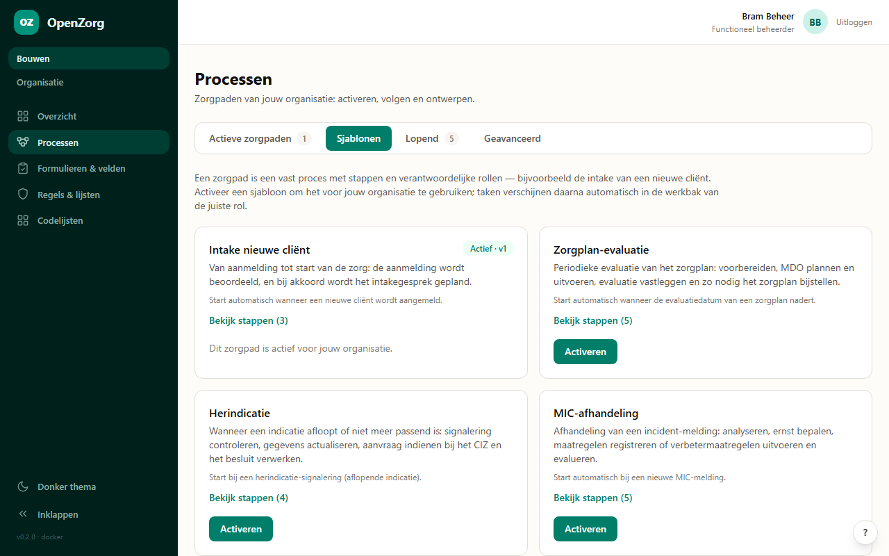
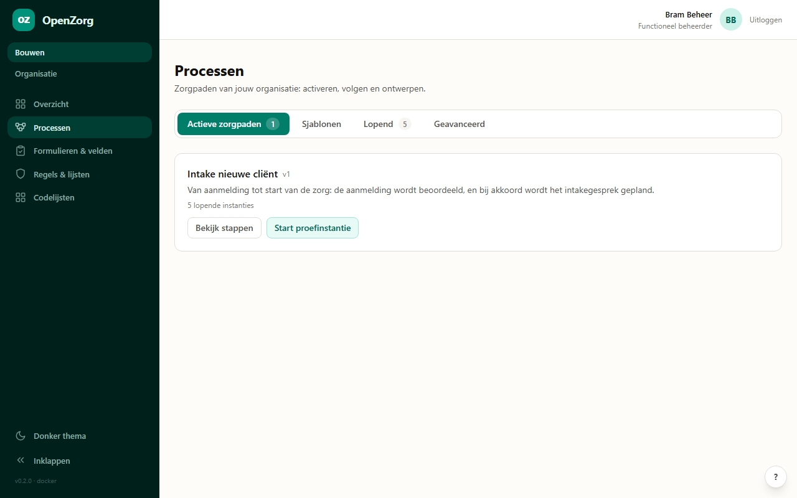
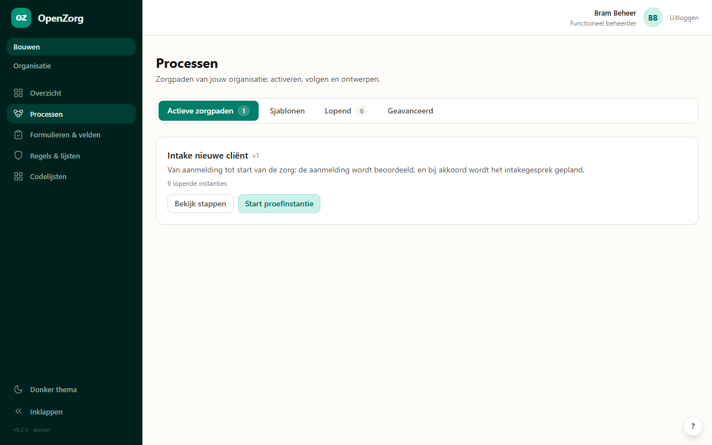
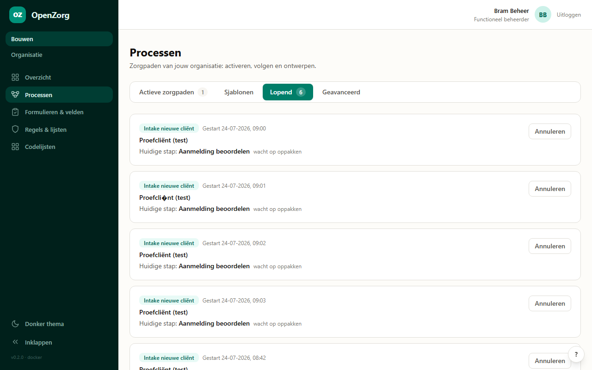
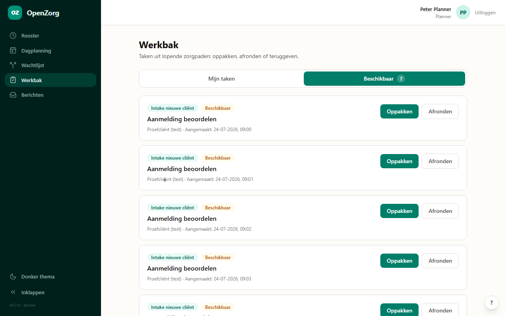
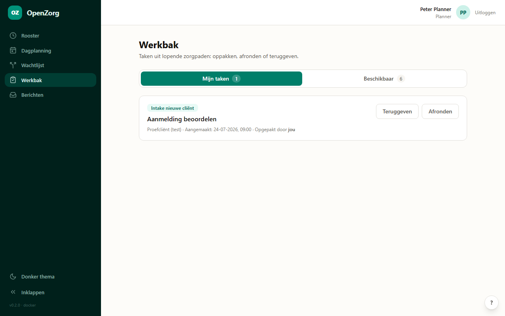
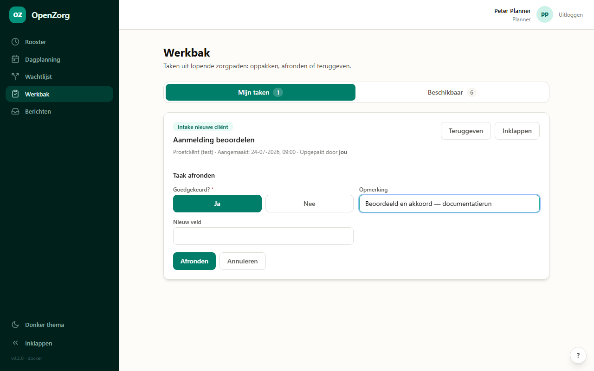

# Intake-zorgpad: van activeren tot afronden

**Wat bewijst dit document?** De volledige proces-keten werkt end-to-end: een beheerder activeert het intake-zorgpad, een instantie start, de taak verschijnt in de werkbak van de juiste rol, wordt persoonlijk opgepakt en met het geconfigureerde formulier afgerond — met zichtbare voortgang in de Processen-hub.

*Elke screenshot hieronder is automatisch gemaakt tijdens een geautomatiseerde run tegen een draaiende omgeving (geen mockups).*

---

## 1 · Sjablonen: zorgpaden in gewone taal

De beheerder opent **Bouwen → Processen → Sjablonen**. Elk zorgpad toont zijn doel, de trigger en de stappen met verantwoordelijke rollen. Activeren = het zorgpad beschikbaar maken voor jouw organisatie.

## 2 · Actieve zorgpaden

Onder **Actieve zorgpaden** staat wat er voor de organisatie draait, met versie en het aantal lopende instanties.

## 3 · Een proefinstantie starten

Met **Start proefinstantie** test de beheerder een zorgpad zonder echte cliënt.

## 4 · Lopend: voortgang per cliënt

De tab **Lopend** toont per lopend zorgpad de cliënt, de huidige stap en wie aan zet is. Annuleren kan alleen mét reden (audit-proof).

## 5 · De taak verschijnt bij de juiste rol

De eerste stap van de intake hoort bij de **planner**. Die ziet de taak in de **Werkbak** onder *Beschikbaar* — automatisch, zonder dat iemand iets hoefde door te sturen.

## 6 · Persoonlijk oppakken

Na **Oppakken** staat de taak onder *Mijn taken*, met naam en al ("Opgepakt door jou"). Collega's zien dat de taak vergeven is.

## 7 · Afronden met het geconfigureerde formulier

Het afrond-formulier komt uit de proces-catalogus: de verplichte Ja/Nee-beslissing stuurt het vervolg van het zorgpad, de opmerking gaat mee in de audit. *(Het veld "Nieuw veld" op deze screenshot is een extra veld dat de functioneel beheerder van deze omgeving zelf via **Taakformulieren** had toegevoegd — precies waarvoor die configuratielaag bestaat.)*

## 8 · De keten stroomt door

Na goedkeuring toont **Lopend** automatisch de volgende stap: *Intake gesprek plannen* — klaar voor de zorgmedewerker.

---

*Gedraaid op 2026-07-24 tegen de staging-omgeving (Unraid), met de per-rol accounts `beheer@horizon.nl` en `planner@horizon.nl`. Gegenereerd via de projectskill `test-documentatie`; herdraaien = zelfde bewijs op elke omgeving.*
